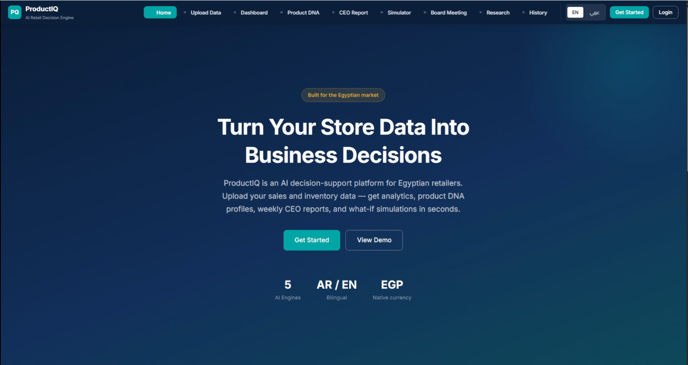
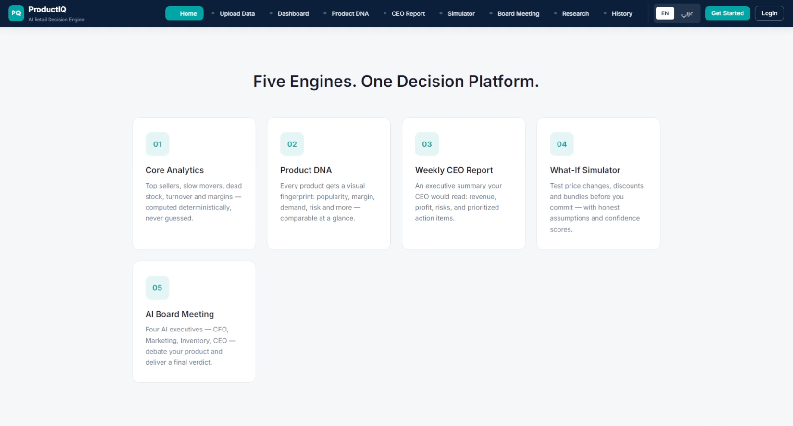
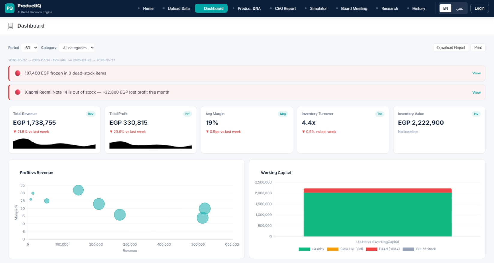
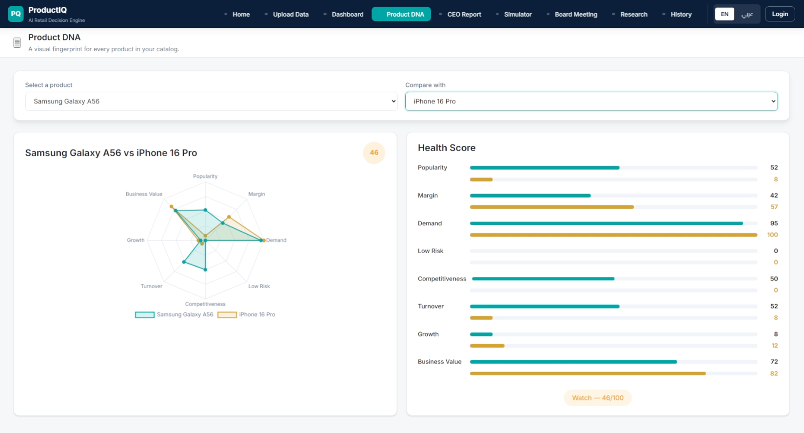
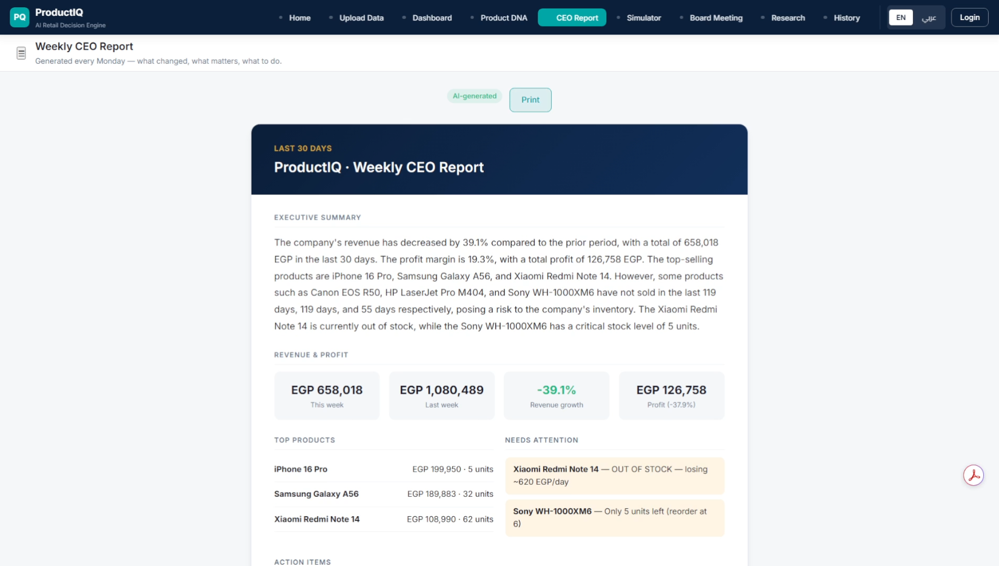
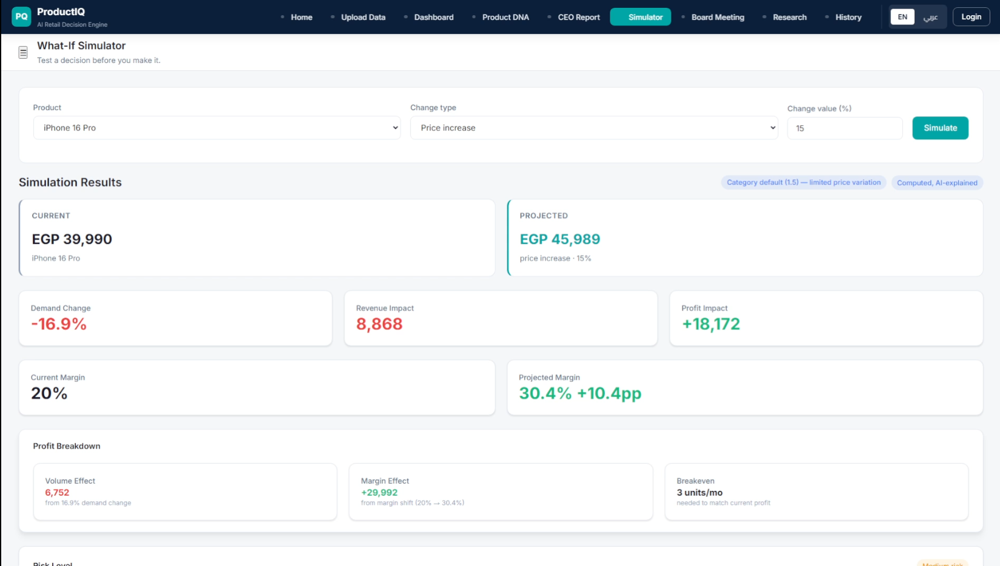
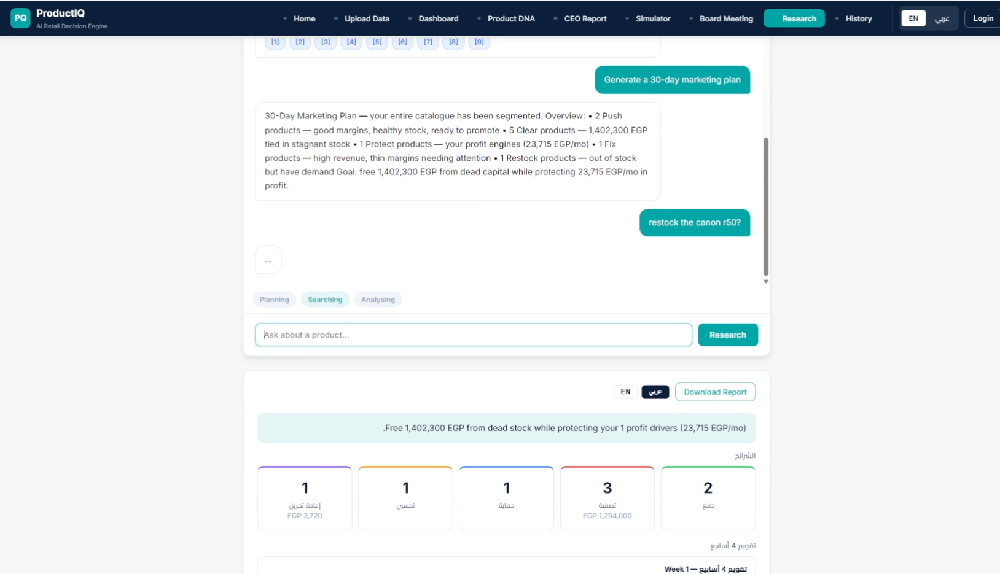

# 🚀 [ProductIQ — AI Retail Decision Engine](https://www.tipshindawi.com/)

> 🏆 This repository is my official submission for the [**Tips Hindawi**](https://www.tipshindawi.com/) **Challenge (June–July) 2026**.

## 👤 Participant

| Field            | Value                                      |
| ---------------- | ------------------------------------------ |
| Full Name        | Marwan Ammar                               |
| Project Name     | ProductIQ — AI Retail Decision Engine      |
| GitHub Username  | [myler71](https://github.com/myler71)      |
| Challenge Batch  | June–July 2026                             |
| Training Program | Large Language Models (LLMs) Program       |
| Organization     | [**Edrak for Ai**](https://edrak4ai.com/en) |

---

# 📖 Project Overview

**ProductIQ** is an AI decision-support platform built for Egyptian retailers. It turns store data into business decisions: upload sales + inventory CSVs and get deterministic analytics, AI recommendations (Arabic/English), Product DNA profiles, a weekly CEO report, a what-if decision simulator, an AI board meeting, and a conversational market research agent.

**Core principle:** *the code does the math, the LLM does the reasoning.* Deterministic Pandas analytics compute the numbers; LangChain + Groq turn them into plain-language decisions — and every AI feature degrades gracefully to rule-based output if the LLM is offline, so the demo never breaks.

---

# ✨ Features

* **Core Analytics** — top sellers, slow movers, dead stock, turnover, margins, and stock risk computed deterministically with Pandas
* **AI Recommendations** — restock / discount / bundle / remove suggestions with reasoning and confidence, in **English and Arabic**
* **Product DNA** — 8-dimension visual fingerprint with health score and side-by-side product comparison (Chart.js radar)
* **Weekly CEO Report** — LLM-generated executive summary, revenue, action items, and supplier alerts — bilingual and printable
* **What-If Simulator** — price/discount scenarios → demand, revenue, profit, and risk with honest stated assumptions
* **AI Board Meeting** — CFO, Marketing, Inventory, and CEO agents debate a product, with the CEO delivering the final verdict
* **Market Research** — conversational agent that plans, searches (Tavily MCP), extracts facts, and generates cited bilingual reports
* **Persistent Memory** — SQLite-backed store for research history, board decisions, and analytics snapshots with diff comparison
* **Bilingual RTL UI** — full Arabic/English interface (Cairo + Inter), EGP-native, tailored to the Egyptian market

---

# 🛠️ Technologies Used

* **Backend:** Python 3.11 · FastAPI · Uvicorn · Pydantic
* **AI/LLM:** LangChain · LangChain-Groq · CrewAI-style multi-agent chains · MCP (Tavily)
* **Data:** Pandas · NumPy · SQLite (persistent memory)
* **Frontend:** Vanilla HTML/CSS/JS (no build step) · Chart.js · i18n (AR/EN, full RTL)
* **Security:** bcrypt · argon2 · signed session cookies (itsdangerous)
* **Testing & CI:** Pytest · GitHub Actions (CI pipeline)
* **Deployment:** Docker (multi-stage build) · Render-ready static + API

---

# ⚙️ Installation

**Prerequisites:** Python 3.11+, Node.js 20+ (for the Tavily MCP research agent), and a Groq/Tavily API key (optional).

### 1. Backend

```powershell
cd ProductIQ/backend
pip install -r requirements.txt
python -m uvicorn app.main:app --host 127.0.0.1 --port 8000 --reload
```

Then open **http://127.0.0.1:8000** — the backend serves the frontend. API docs: **http://127.0.0.1:8000/docs**

### 2. LLM keys (optional)

Copy `backend/.env.example` → `backend/.env` and add your keys:

```
GROQ_API_KEY=your-key
GROQ_MODEL=llama-3.3-70b-versatile
TAVILY_API_KEY=your-key   # for the market research agent
```

No key? Everything still works with deterministic fallback output.

### 3. Docker

```powershell
docker build -t productiq .
docker run -p 8000:8000 productiq
```

### 4. Frontend only (no backend)

Open any file in `frontend/` directly in a browser — the UI falls back to built-in mock data automatically.

### 5. Sample data

The Egyptian electronics-shop dataset (10 products, ~330 sales over 4 months, 5 suppliers) is pre-generated. Regenerate it with:

```powershell
python datasets/generate_sample_data.py
```

### 6. Run tests

```powershell
cd backend && python -m pytest
```

---

# 🚀 Usage

1. **Upload your data** on the `upload.html` page — sales, inventory, suppliers, and pricing CSVs (or click *Load Sample Data* to use the bundled Egyptian dataset).
2. **Review analytics** on the dashboard — KPIs, trends, slow movers, and stock risk.
3. **Get AI recommendations** in English or Arabic for restocking, discounts, bundles, and removals.
4. **Explore Product DNA** for any product to see its 8-dimension health fingerprint and compare products side-by-side.
5. **Run what-if simulations** — change price or discount and see predicted demand, revenue, and profit.
6. **Hold an AI board meeting** — let the CFO, Marketing, Inventory, and CEO agents debate a product.
7. **Ask the market research agent** any question and receive a cited bilingual report.

**Default admin login** (change it in `.env`): `admin` / `admin123`

---

# 📸 Demo

### 🏠 Landing Page



### ✨ Overall Features



### 📊 Dashboard & Analytics



### 🧬 Product DNA



### 📋 Weekly CEO Report



### 🎯 What-If Simulator



### 🔍 Market Research



---

**Quick demo:** run the backend and open `http://127.0.0.1:8000` — the dashboard loads with sample data instantly. You can also open the frontend HTML files directly in any browser for a design demo with mock data.

**Presentation:** see the `presentations/` folder for slide decks.

---

# 📈 Results

* **7 decision engines** delivered end-to-end (analytics, AI recommendations, Product DNA, CEO report, simulator, board meeting, market research)
* **Full bilingual (Arabic/English) RTL experience** tailored to Egyptian retailers
* **Graceful degradation** — every AI feature falls back to deterministic rules when the LLM is offline
* **12 test modules** covering auth, analytics, routes, LLM chains, memory, and MCP client, with a **GitHub Actions CI pipeline** running tests + server smoke check
* **Dockerized** deployment with a multi-stage build

---

# 🔮 Future Improvements

* Add real-time inventory sync from ERP/pos systems (Odoo, Shopify, Zoho)
* Integrate more LLM providers (OpenAI, Google, NVIDIA) with automatic routing/fallback
* Add forecasting models (Prophet / ARIMA) for demand prediction
* Expand the research agent with more MCP servers (news, suppliers, competitors)
* Build a React/Nuxt frontend with charts, notifications, and role-based dashboards
* Deploy to AWS SageMaker / EC2 for scalable inference

---

# 📚 About the Challenge

This project was developed as part of the [**Tips Hindawi**](https://www.tipshindawi.com/) **Challenge (June–July) 2026**.

[Tips Hindawi](https://www.tipshindawi.com/) is the internships department of [**Edrak for Ai**](https://edrak4ai.com/en), and the challenge encourages participants to build real-world projects, apply practical skills, and showcase their work through GitHub.

For more information about the challenge, training programs, and upcoming batches, visit the official [Tips Hindawi](https://www.tipshindawi.com/) website.

---

# 📄 License

This project is shared for educational and portfolio purposes. © 2026 Marwan Ammar (myler71). Free to use, learn from, and adapt for non-commercial purposes.
